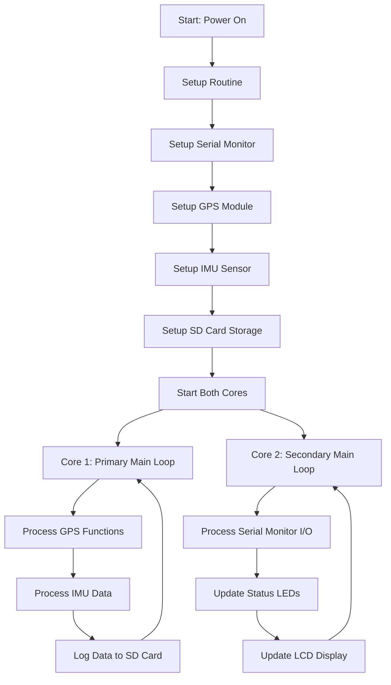
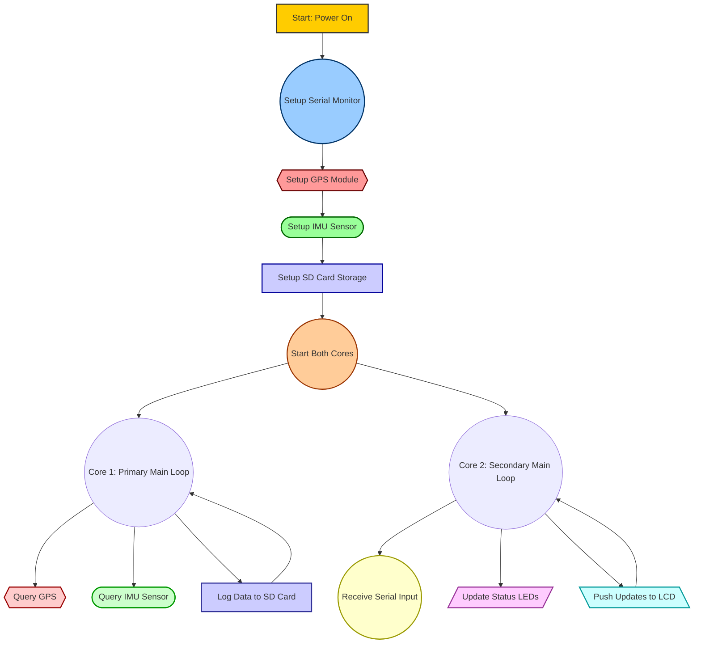

# Vehicle mounted data recorder
  - TARGET HARDWARE: RASPBERRY PI PICO W + BOSCH BN0055 + uBLOX NEO-7M
  - AUTHOR: CHRIS MCCREARY
  - VERSION: 0.0.2a
  - DATE: 2024-12-31

#KEY NOTES:
  o For saving to SD card, filenames are limited to 8+3 in length.
  o To keep session names unique, a session is created with a random 16 bit / 2 byte / 4 hex character ID (0x0000-0xFFFF).
  o Session IDs will serve as the prefix for each session.
  o Each session will hold an index file (XXXXindx.txt) and timestamp file (XXXXtime.txt).
    - The index file will hold any header info.
    - The timestamp file will only be created once we have a valid epoch timestamp.
  o Each data file will start with the session ID, and be suffixed with a 16 bit sequence number, for a maximum of 65,535 data files per session.
  o Each data file has an arbitrary limit of 10Kb before it starts a new data file.
  o Assuming an average data entry size of ~160bytes, this should give us:
    - ~6400 entries per data file
    - ~419,424,000 entries per session
  o Assuming a data entry once per second, this should give us:
    - ~6,990,400 minutes / 116,506.6 hours of runtime
  o Assuming an 8Gb SD card, this should give us:
    - ~13 maximum sessions before the disk is full
  o THEORETICALLY! Theoretically, I should be dating Jessica Alba.

# GOALS:
 - Balance CPU usage; currently running on a single core
 - Save CPU time by getting epoch time WITH PPS sync every so often
 - Leverage Mesh networking with onboard WiFi / Dump WiFiManager/MQTT?
 - Over the air message confirmation & repeatback of received remote commands
 - Add packet parsing on the fly, retain count/GID/UID/RSSI/NOISE, dump the rest

## Boot Sequence for Dual-Core Raspberry Pi Pico

## Enhanced Boot Sequence with Shapes and Colors

